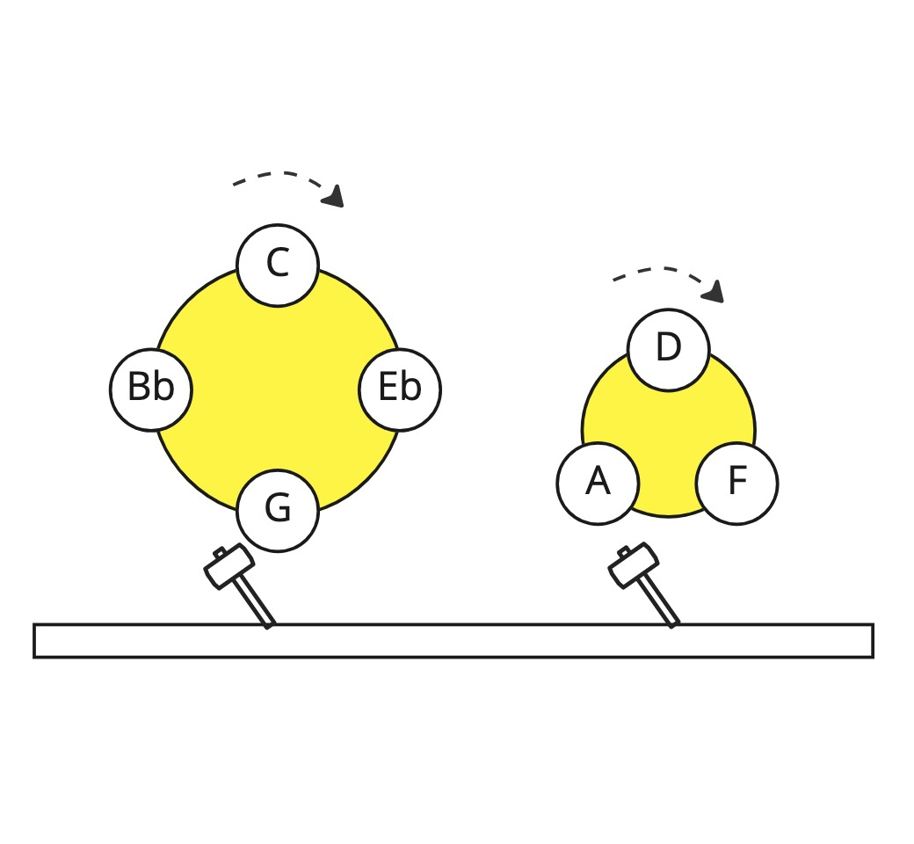

# midi-arpeggiator
A midi arpeggiator made up of spinning plates with notes around each plate.
As each note is hit by the mallet, a midi note is sent to an output channel.
The number of notes for each plate, and the spinning speed and few other parameters can be configured.

